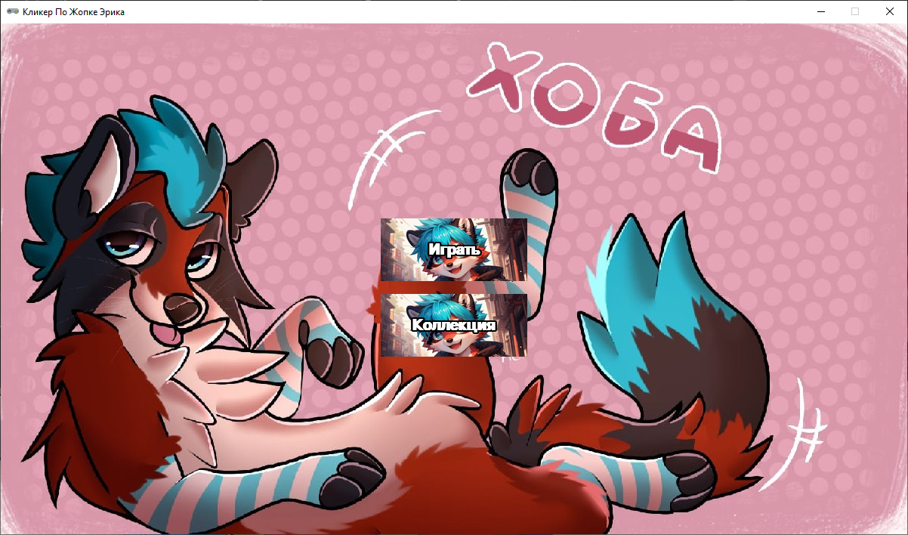
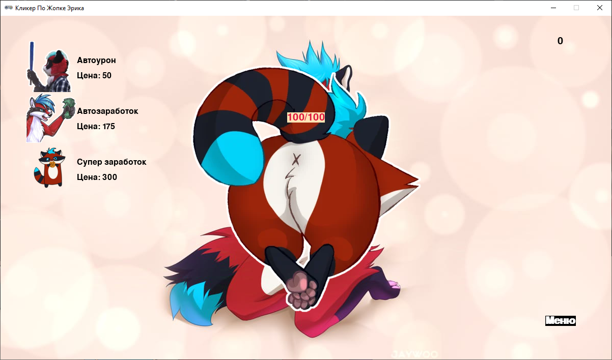
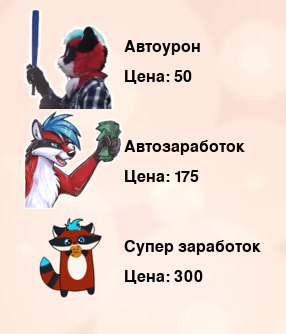
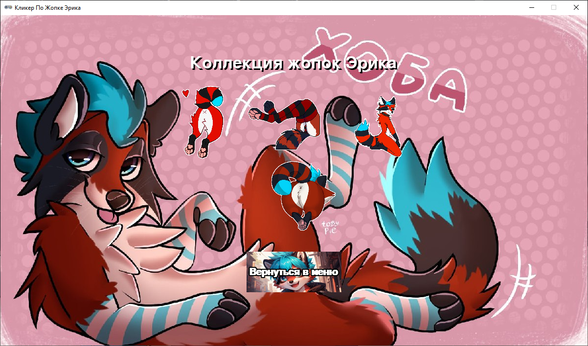

# 🎮 **Кликер По Жопке Эрика**  

**🚀 О проекте**  
Весёлая инкрементальная игра на Python, где нужно кликать по жопке Эрика, прокачивать бонусы и проходить уровни!  

  
*Главное меню игры*

---

## ✨ **Особенности**  

### 🎯 **Геймплей**  
- 👆 **Кликай** по жопке, чтобы наносить урон  
- 💰 **Зарабатывай** очки и покупай улучшения  
- 🤖 **Автоматические бонусы** помогают без постоянных кликов  

  
*Основной игровой экран*

### 📈 **Система уровней**  
| Уровень | HP      | Внешний вид |  
|---------|---------|-------------|
| 1       | 100     |  |  
| 2       | 250     |  |  
| 3       | 400     |  |  
| 4       | 666     |  |  

### 🛒 **Улучшения**  
  
*Доступные улучшения в игре*

### 🎨 **Другие экраны**  
  
*Галерея с коллекцией жопок*

---

## 🛠 **Техническая часть**  
```python
# Пример кода игры
def on_mouse_down(pos, button):
    if button == mouse.LEFT and enemy.collidepoint(pos):
        hp -= damage  # Наносим урон!
        count += 1    # Зарабатываем очки
        animate(enemy, tween='bounce_end', duration=0.5)  # Анимация
```

**Технологии**:
- 🐍 Python 3.10+
- 🎮 Pygame Zero
- 🖼️ Pygame для обработки изображений

---

## 📂 **Установка и запуск**  
1. Клонируйте репозиторий:
```bash
git clone https://github.com/yourname/eric-clicker.git](https://github.com/Enot222SJG/clicker_ericmyval.git
cd clicker_ericmyval
```

2. Установите зависимости:
```bash
pip install pygame 
```

3. Запустите игру:
```bash
python clicker.pyw
```

---

## 🤝 **Как помочь проекту**  
- 🌟 Поставьте звезду на GitHub
- 🐞 Сообщайте об ошибках в Issues
- 💡 Предлагайте улучшения через Pull Requests

---

## 📜 **Лицензия**  
MIT License - свободное использование с указанием авторства


**Приятной игры!** 🎮
